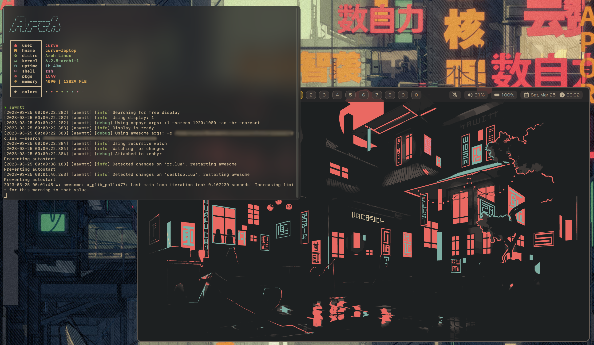

<hr>

<div align="center"> 
    
    <h3>
        aawmtt
    </h3>
</div>

<p align="center"> 
    Another AwesomeWM Testing Tool, written in C++20
</p>

---

## Features

- Live Reload
- Proper Display detection

## Why?

The original [awmtt](https://github.com/gmdfalk/awmtt) as well as [awmtt-ng](https://github.com/basaran/awmtt-ng) have several issues.

1. awmtt-ng seems to have issues with detecting free displays and will straight up ignore the display passed through "-D".

2. For me they both exit instantly when the config is a sym-link or somewhere else than in "~/.config/awesome".

3. Better Live-Reload 

### Packages

- [AUR](https://aur.archlinux.org/packages/aawmtt)

### Dependencies

- A C++20 Compiler *(Tested on Clang 15)*
- Xephyr
- Xlib

### Installation

```sh
mkdir build && cd build
cmake .. && cmake --build . --config Release
```

### Usage

```
aawmtt - v2.0
Usage: aawmtt [OPTIONS]

Options:
  -h,--help                                                 Print this help message and exit
  -x,--xephyr TEXT [Xephyr]                                 Location of xephyr binary
  -a,--awesome TEXT [awesome]                               Location of awesome binary
  -d,--display UINT                                         The Xorg display to use
  -s,--size TEXT [1920x1080]                                Size for the xephyr window
  -r,--reload BOOLEAN [1]                                   Enable/Disable auto-reload
  -R,--recursive BOOLEAN [1]                                Watch files recursively
  -c,--config TEXT [~/.config/awesome/rc.lua]               AwesomeWM config to load
  -w,--watch TEXT                                           Directory to watch for auto-reload
  --awesome-args TEXT ...                                   Additional arguments for awesome
  --xephyr-args TEXT [[-ac,-br,-noreset]]  ...              Arguments for xephyr
```

### Screenshots


